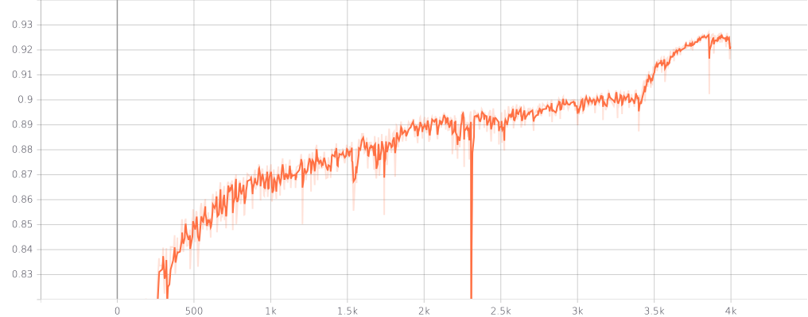
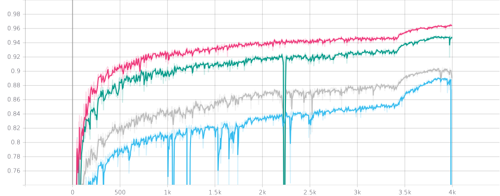

# Overhead Geopose Challenge

[Overhead Geopose Challenge](https://www.drivendata.org/competitions/78/overhead-geopose-challenge/)

[4th
place](https://www.drivendata.org/competitions/78/overhead-geopose-challenge/leaderboard/)
out of 444 participants with 0.8731 R2 coefficient of determination (top1 0.924).

## Prerequisites

- GNU/Linux
- [PyTorch](https://pytorch.org/)
- [NVIDIA apex](https://github.com/NVIDIA/apex)
- [GDAL](https://gdal.org/index.html)
- 4 GPUs with 32GB VRAM (e.g. DGX station with Tesla V100)

You can use 1 GPU but the training process will take almost 4 times longer.

To set up the environment, run:
```
pip install -r requirements.txt
conda install -c conda-forge gdal
```

## Usage

### Data preprocessing

Download data from the competition link into `data` folder and run

```bash
sh ./preprocess.sh
```

Optionally you may save images to `lmdb` to speedup training.

```bash
sh ./save_to_lmdb.sh
```

Note you will need ~200GB disk space and RAM (rewrite the code for iterative
preprocessing not loading all data into the memory).

### Training

```bash
sh ./dist_train.sh
```

It will take about 1 week on 4 GPUs.

### Inference

You can download pretrained models
[here](https://disk.yandex.com/d/YKBkCPWV1jaYrg) (extract via `unzip models.zip
-d chkps_dist`).

```bash
sh ./dist_test.sh  # adjust number of GPUs
# sh ./test.sh     # or for single GPU
```

## Approach

The method is based on the solution provided by the authors, but in a simpler
and straightforward way. Using Unet architecture with various encoders
(`efficientnet-b{6,7}` and `senet154`). The model has only one above ground
level (AGL) head and two heads in the bottleneck for scale and angle. The model
takes a random 512x512 crop of an aerial image, the city's one hot encoding and
ground sample distance (GSD) as input. Then the model outputs the AGL, vector
flow scale and angle. The model is trained with mean squared error (MSE) loss
function for all targets (AGL, scale, angle) using AdamW optimizer with `1e-4`
learning rate. Cosine annealing scheduler with period 25 is used. To reduce the
memory consumption and to speedup the training process the model is trained in
mixed precision regime with batch size 8. At inference time the model takes a
full size `2048x2048` aerial image and outputs a full size AGL.

First, the model is pretrained with heavy augmentations (like flips, rotations,
color jittering, scaling, height augmentations etc.) for 525 epochs and then
finetuned another 1025 epochs *without* any augmentations.

*Remark*: It turns out that augmentations are damaging for model performance.
Model is trained faster without any augmentations and has better performance
according to validation.

*Note*: A single model projected to be 4th place with 0.86 `R2` coefficient of
determination.

Typical learning curves of the model

Competition metric


Metrics per city (pink ATL, green JAX, grey OMA and cyan ARG)


We can see that metrics are improving drastically after turning off the
augmentations.

## Things didn't work

- MSE loss on logarithmic AGL
- Finetuning per city
- Heavy augmentations
- Predict VFLOW and find xy axes via pseudo-inverse (like for scale)
- [TGV denoising](https://github.com/DanonOfficial/TGVDenoising)

## Highlights

- Unet-like models with `efficientnet` and `senet` encoders
- One head for AGL and two heads in the bottleneck for scale and angle
- Train on random crops with `512x512` size
- Additional features: city and GSD
- Pretrain with heavy augmentations and finetune without any ones
- Batchsize 8 
- `AdamW` optimizer with `1e-4` learning rate
- `CosineAnnealingLR` scheduler with period 25 epochs
- Ensemble of models (averaged AGL, scale and angle)
